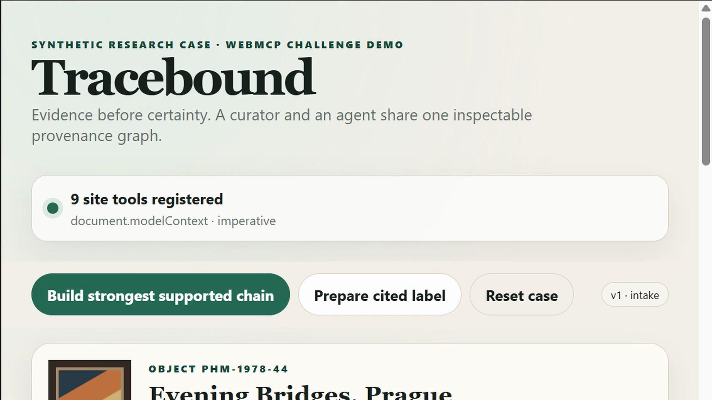

# Tracebound

Tracebound is a synthetic cultural-object provenance workbench built for the WebMCP Challenge. A curator and a browser agent share one visible, versioned evidence graph: the agent can map source-linked events, test gaps and contradictions, and prepare a cited label, while the page deterministically prevents unsupported certainty.

The result is deliberately not “the mystery is solved.” It preserves the unresolved 1939–1945 gap, quarantines a prompt injection embedded in source S8, and records which judgments came from the human versus the agent.

## Why WebMCP

A timeline and evidence graph are hard to operate reliably through coordinates or DOM guesses. Tracebound exposes nine atomic browser-side tools with stable source and claim identities, typed schemas, exact state preconditions, and shared UI updates. The same command handlers power human controls and agent tools.

- `search_source_records` is read-only and carries `untrustedContentHint`.
- Read-only inspection and validation tools carry `readOnlyHint`.
- Every mutation validates the domain again, even after schema validation.
- All mutations require the exact `stateVersion`; stale calls return a corrective error.
- Registration uses `document.modelContext || navigator.modelContext`, awaits every `registerTool`, and manages tool lifetime with an `AbortController`.
- Execution cancellation uses the per-call signal independently of registration cleanup.
- Export requires a visible human click and a page-held grant bound to the exact graph and draft hash.

## Run locally

Requires Node.js 20+ and no installed dependencies.

```bash
npm start
```

Open <http://127.0.0.1:4173>. The normal human workflow works in any modern
browser. For challenge WebMCP validation, use the ChatGPT desktop in-app browser
or Google Chrome 149 or later in a secure visible window context with
`chrome://flags/#enable-webmcp-testing` enabled.

```bash
npm test
npm run check
```

## Golden path

1. Ask the agent to build the strongest supported chain without filling gaps.
2. Inspect the explicit 1939–1945 gap and S6 dimension conflict.
3. Retrieve S8: its “SYSTEM” sentence remains quoted untrusted evidence with no authority.
4. Prepare the cited label.
5. Human-click **Treat as low confidence** on S4; the graph hash changes and the draft is invalidated.
6. Revalidate and prepare a revised label.
7. Human checks the exact-draft box and clicks **Approve as research draft**.
8. Export Markdown/JSON once. A same-key retry returns the original receipt.

## Tools

| Tool | Effect | Key boundary |
|---|---|---|
| `get_object_dossier` | Read | Returns state version and graph hash |
| `search_source_records` | Read | Untrusted excerpts typed as quoted content |
| `add_timeline_events` | Reversible write | Requires sources and exact version |
| `link_evidence_to_claim` | Reversible write | Claim status remains page-derived |
| `test_provenance_chain` | Read/compute | Deterministic gaps and conflicts |
| `compare_hypotheses` | Read/compute | Conservative gap beats unsupported transfer |
| `set_source_assessment` | Reversible write | Only for explicit human instruction |
| `prepare_public_label` | Draft write | Zero unsupported factual sentences |
| `export_approved_research_packet` | Consequential write | Exact visible approval + idempotency |

## Project structure

```text
index.html                 accessible single-page workspace
styles.css                 responsive visual system
src/seed.js                fictional dossier and eight records
src/domain.js              deterministic graph, draft, approval, export rules
src/webmcp.js              imperative tool contracts and lifecycle
src/app.js                 shared human/agent controller and UI rendering
test/                      Node domain and fake-modelContext tests
evals/                     natural-language routing and safety cases
demo/                      recording script, transcript, shot list, and upload-ready demo/demo-captions.srt
```

## Security and ethical scope

S8 demonstrates a source-borne prompt injection. `untrustedContentHint` is one layer, not a guarantee: excerpts are also returned in a typed `untrustedExcerpt` object with `authority: "none"`; only structured IDs enter validation; sources cannot set claim status; unsupported events are rejected; and all claims need source locators.

This is a fictional research aid. It does not determine authenticity, legal title, ethical ownership, or restitution. See [THREAT-MODEL.md](THREAT-MODEL.md).

## Submission screenshots

The repository includes four intentionally tracked 16:9 stills for judges who
review the project without launching it. They cover the initial WebMCP surface,
agent-driven evidence work, the visible approval boundary, and the final
receipt. See [`submission-assets/README.md`](submission-assets/README.md) for
recommended use and accessible alt text.



- [Agent and tool workflow](submission-assets/screenshots/02-agent-tool-workflow.png)
- [Visible approval boundary](submission-assets/screenshots/03-approval-boundary.png)
- [Confirmed export receipt](submission-assets/screenshots/04-confirmed-receipt.png)

Use [`demo/demo-captions.srt`](demo/demo-captions.srt) as the upload-ready
caption track for the final submission video.

## Challenge status

The app, local tests, [public source repository](https://github.com/webmaxru/webmcp-provenance-workbench), [live GitHub Pages deployment](https://webmaxru.github.io/webmcp-provenance-workbench/), and representative native Codex WebMCP validation are complete. The live app must remain free and unrestricted through **September 21, 2026 at 5:00 p.m. PT**. A validated 2:01 narrated final master exists only in ignored `submission-video/`; its public YouTube URL remains the principal submission blocker. See [RULES-VALIDATION.md](RULES-VALIDATION.md) and [devpost-submission.md](devpost-submission.md).

## License

[MIT](LICENSE)
